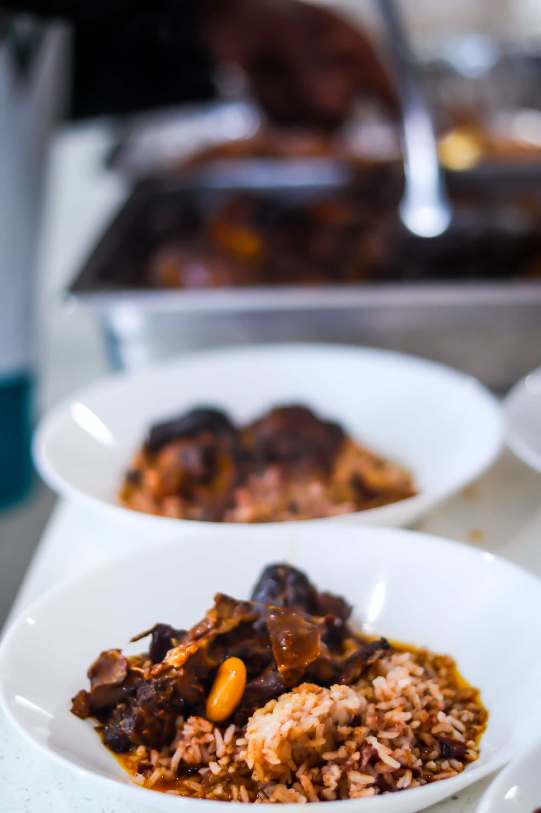

# Southern Smothered Oxtails

Serves 4.

Slow-cooked oxtails braised in a dark, peanut-butter-brown onion gravy. Sear the meat, build a proper roux, and let the crock pot do the rest.

## Ingredients

### Oxtails & rub

- 2-3 pounds Oxtails, hard fat trimmed
- 2 tablespoons Worcestershire sauce
- 2 tablespoons Browning sauce (e.g. Kitchen Bouquet)
- 1 teaspoon Kosher salt
- 1 teaspoon Black pepper
- 1 teaspoon Paprika
- 1 teaspoon Garlic powder
- 1 teaspoon Onion powder

### Sear

- 2-3 tablespoons Avocado oil (or another high-smoke-point oil)

### Onion gravy

- 1/4 cup Butter
- Reserved sear drippings, plus more avocado oil as needed
- 1/2 cup All-purpose flour
- 1 cup Yellow onion, diced
- 3-4 cloves Garlic, minced
- 4 cups Beef broth (low-sodium)
- 1 tablespoon Brown sugar
- 1 teaspoon Onion powder
- Kosher salt, to taste

### Optional add

- 8 ounces Cremini mushrooms, sautéed

### To serve

- Cooked white rice

## Instructions

### Prep the oxtails

- Trim the hard, waxy fat off each oxtail with a paring knife; the softer fat will render, but the hard fat won't
- Pat the oxtails dry
- Coat them with the Worcestershire and browning sauce, keeping one hand wet and one hand dry
- Season with salt, pepper, paprika, garlic powder, and onion powder; toss to coat evenly and let sit while the pan heats

### Sear

- Heat the avocado oil in a cast-iron skillet over medium-high heat until shimmering
- Sear the oxtails in batches, 2-3 minutes per side, including the narrow edge — you want deep brown, not gray
- Transfer to the slow cooker as they finish
- Reserve the pan with its drippings

### Build the roux

- Melt the butter into the reserved drippings over medium heat, adding more oil if the pan is dry
- Whisk in the flour a little at a time to avoid lumps
- Keep whisking for 8-12 minutes, until the roux is a deep peanut-butter brown; darker roux equals nuttier gravy

### Aromatics

- Add the diced onion and minced garlic to the roux
- Stir for about 2 minutes, until the onion releases water and starts to soften
- Add the onion powder and a pinch of salt

### Finish the gravy

- Pour in the beef broth gradually, whisking to keep it smooth
- Stir in the brown sugar
- Bring to a light simmer; taste and adjust salt
- The gravy should be pourable — thin with a splash more broth if it tightens up

### Slow cook

- Pour the gravy over the oxtails in the slow cooker; they must be fully submerged
- Cover and cook on HIGH:
  - 6 hours for smaller cuts
  - 8 hours for larger center-cut oxtails
- The meat is done when it pulls back from the bone and shreds with a fork

### Serve

- Spoon the oxtails and gravy over white rice
- Ladle extra gravy on top
- If the gravy has tightened in the crock pot, thin it with warm beef or chicken broth

## Tips

- Trim the hard fat — it never renders and only makes the finished gravy greasy
- Sear before slow-cooking; skipping this step trades a full layer of flavor for 15 minutes of active time
- Take the roux past golden into peanut-butter brown — this is where the depth comes from, like a gumbo roux
- No black pepper in the sear rub if you want a lighter-colored final gravy; the recipe uses it for flavor, not appearance

## Substitutions

- Browning sauce: 1 extra tablespoon Worcestershire plus a teaspoon of soy sauce for color
- Avocado oil: any neutral high-smoke-point oil (grapeseed, refined peanut)
- Beef broth: chicken broth in a pinch, with an extra teaspoon of Worcestershire for depth
- Mushrooms: baby bella or button, sautéed separately and stirred in during the last hour

## Storage

- Refrigerator: up to 4 days in an airtight container
- Freezer: up to 3 months
- Reheating: stovetop over low heat, adding a splash of broth if the gravy has thickened

## References

- [Oxtails Recipe - How to Make the Best Oxtails - #SoulFoodSunday](https://www.youtube.com/watch?v=Boc22El-rGE) — Soul Food Cooking (base spice list and slow-cooker onion-gravy structure)
- [Melt-In-Your-Mouth Smothered Oxtails!](https://www.youtube.com/watch?v=sUCRTCMrgYo) — Smokin' & Grillin with AB (fat-trim, sear-first, dark roux, 6-8 hr cook time)
- Photo by [Thomas Wilson](https://www.pexels.com/@thomas-wilson-1334312084/) on [Pexels](https://www.pexels.com/photo/delicious-jamaican-oxtail-and-rice-dish-30746554/) (free use under the Pexels license)
